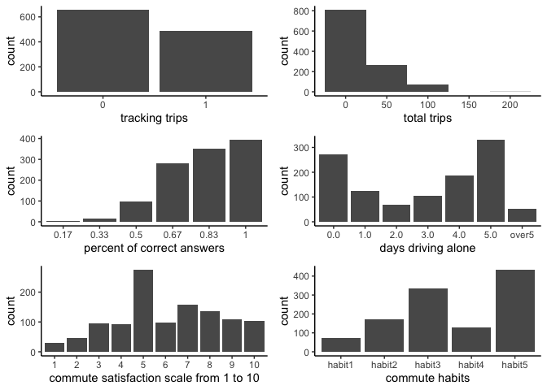

Survey Analysis
================

### Exploratory graphs

<!-- -->

Commute habit options:

  - I drive alone for most of my trips, and don’t intend to make a
    change.
  - I drive alone for most of my trips, and I’m considering changes but
    don’t know how.
  - I drive alone for most of my trips, and I’m considering making
    changes but haven’t started.
  - I already use other ways than driving alone and have been doing so
    for less than 6 months.
  - I already use other ways than driving alone and have been doing so
    for more than 6 months.

### OLS

    ## 
    ## Call:
    ## lm(formula = trip_sum ~ correct_sum + Adlformcommutesatisfaction + 
    ##     Adlformdrivealonedays + Adlformtypicalweek, data = survey_combined)
    ## 
    ## Residuals:
    ##     Min      1Q  Median      3Q     Max 
    ## -50.311  -6.354  -1.715   6.634 138.408 
    ## 
    ## Coefficients:
    ##                            Estimate Std. Error t value Pr(>|t|)    
    ## (Intercept)                 33.5554     5.1821   6.475 1.41e-10 ***
    ## correct_sum                 -0.3678     0.6298  -0.584 0.559320    
    ## Adlformcommutesatisfaction   0.5231     0.3099   1.688 0.091668 .  
    ## Adlformdrivealonedays1.0   -17.5689     2.3908  -7.348 3.84e-13 ***
    ## Adlformdrivealonedays2.0   -24.2620     2.9913  -8.111 1.30e-15 ***
    ## Adlformdrivealonedays3.0   -30.3293     2.7627 -10.978  < 2e-16 ***
    ## Adlformdrivealonedays4.0   -30.2846     2.7227 -11.123  < 2e-16 ***
    ## Adlformdrivealonedays5.0   -32.8315     2.7002 -12.159  < 2e-16 ***
    ## Adlformdrivealonedaysover5 -33.5672     3.8737  -8.665  < 2e-16 ***
    ## Adlformtypicalweekhabit2    -0.8457     3.0326  -0.279 0.780397    
    ## Adlformtypicalweekhabit3     0.2141     2.8086   0.076 0.939240    
    ## Adlformtypicalweekhabit4    12.1509     3.4820   3.490 0.000502 ***
    ## Adlformtypicalweekhabit5    12.6279     3.2888   3.840 0.000130 ***
    ## ---
    ## Signif. codes:  0 '***' 0.001 '**' 0.01 '*' 0.05 '.' 0.1 ' ' 1
    ## 
    ## Residual standard error: 21.77 on 1128 degrees of freedom
    ## Multiple R-squared:  0.4279, Adjusted R-squared:  0.4218 
    ## F-statistic:  70.3 on 12 and 1128 DF,  p-value: < 2.2e-16

### Logistic regression

    ## 
    ## Call:
    ## glm(formula = trip_dummy ~ correct_sum + Adlformcommutesatisfaction + 
    ##     Adlformdrivealonedays + Adlformtypicalweek, family = "binomial", 
    ##     data = survey_combined)
    ## 
    ## Deviance Residuals: 
    ##     Min       1Q   Median       3Q      Max  
    ## -1.9499  -0.6565  -0.4126   0.7177   2.3386  
    ## 
    ## Coefficients:
    ##                            Estimate Std. Error z value Pr(>|z|)    
    ## (Intercept)                 0.57839    0.59438   0.973 0.330503    
    ## correct_sum                -0.13392    0.07330  -1.827 0.067713 .  
    ## Adlformcommutesatisfaction  0.02250    0.03607   0.624 0.532801    
    ## Adlformdrivealonedays1.0   -0.62120    0.24936  -2.491 0.012730 *  
    ## Adlformdrivealonedays2.0   -0.68535    0.30630  -2.238 0.025251 *  
    ## Adlformdrivealonedays3.0   -0.94687    0.28103  -3.369 0.000754 ***
    ## Adlformdrivealonedays4.0   -1.35878    0.28057  -4.843 1.28e-06 ***
    ## Adlformdrivealonedays5.0   -2.16323    0.29600  -7.308 2.71e-13 ***
    ## Adlformdrivealonedaysover5 -2.30509    0.53434  -4.314 1.60e-05 ***
    ## Adlformtypicalweekhabit2   -0.36893    0.40723  -0.906 0.364959    
    ## Adlformtypicalweekhabit3    0.04618    0.35816   0.129 0.897418    
    ## Adlformtypicalweekhabit4    1.40989    0.39849   3.538 0.000403 ***
    ## Adlformtypicalweekhabit5    1.33750    0.38052   3.515 0.000440 ***
    ## ---
    ## Signif. codes:  0 '***' 0.001 '**' 0.01 '*' 0.05 '.' 0.1 ' ' 1
    ## 
    ## (Dispersion parameter for binomial family taken to be 1)
    ## 
    ##     Null deviance: 1556.6  on 1140  degrees of freedom
    ## Residual deviance: 1110.3  on 1128  degrees of freedom
    ## AIC: 1136.3
    ## 
    ## Number of Fisher Scoring iterations: 4
