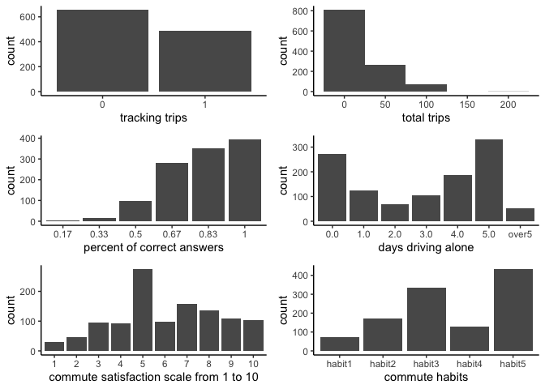
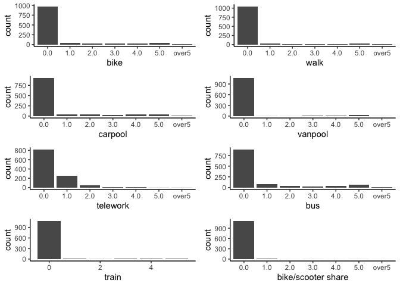
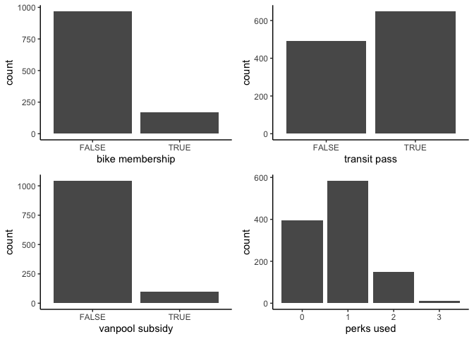
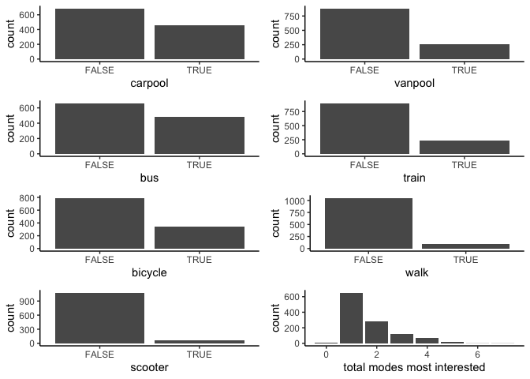
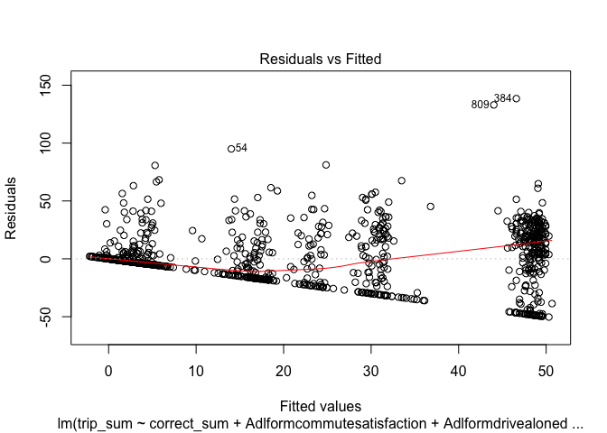
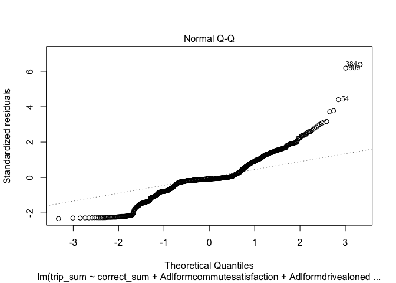
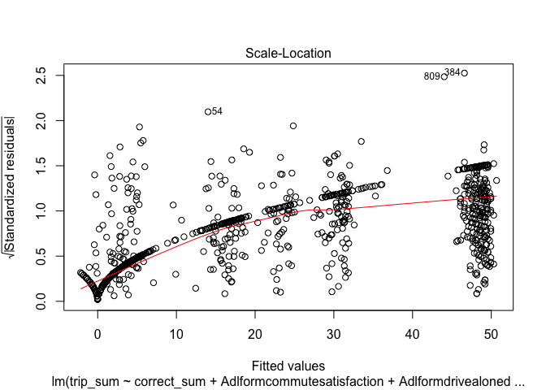
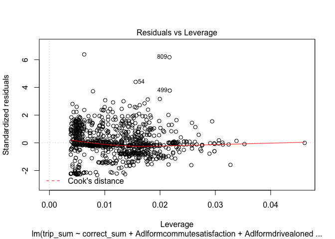

Survey Analysis
================

### Exploratory graphs

<!-- -->

Commute habit options:

  - I drive alone for most of my trips, and don’t intend to make a
    change.
  - I drive alone for most of my trips, and I’m considering changes but
    don’t know how.
  - I drive alone for most of my trips, and I’m considering making
    changes but haven’t started.
  - I already use other ways than driving alone and have been doing so
    for less than 6 months.
  - I already use other ways than driving alone and have been doing so
    for more than 6 months.

#### Days using the following commute mode per week

<!-- -->

Carpool and bus appear to be the commute options used most frequently.
Other options are excluded in the regression models.

#### Use of employee perks

<!-- -->

Follow-up question: why did you not use any of them?

#### Commute modes most interested in trying

<!-- -->

Since most people were not interested in walk and scooter, these options
are excluded from the regression models.

### OLS

    ## 
    ## Call:
    ## lm(formula = trip_sum ~ correct_sum + Adlformcommutesatisfaction + 
    ##     Adlformdrivealonedays + Adlformtypicalweek, data = survey_combined)
    ## 
    ## Residuals:
    ##     Min      1Q  Median      3Q     Max 
    ## -50.311  -6.354  -1.715   6.634 138.408 
    ## 
    ## Coefficients:
    ##                            Estimate Std. Error t value
    ## (Intercept)                 33.5554     5.1821   6.475
    ## correct_sum                 -0.3678     0.6298  -0.584
    ## Adlformcommutesatisfaction   0.5231     0.3099   1.688
    ## Adlformdrivealonedays1.0   -17.5689     2.3908  -7.348
    ## Adlformdrivealonedays2.0   -24.2620     2.9913  -8.111
    ## Adlformdrivealonedays3.0   -30.3293     2.7627 -10.978
    ## Adlformdrivealonedays4.0   -30.2846     2.7227 -11.123
    ## Adlformdrivealonedays5.0   -32.8315     2.7002 -12.159
    ## Adlformdrivealonedaysover5 -33.5672     3.8737  -8.665
    ## Adlformtypicalweekhabit2    -0.8457     3.0326  -0.279
    ## Adlformtypicalweekhabit3     0.2141     2.8086   0.076
    ## Adlformtypicalweekhabit4    12.1509     3.4820   3.490
    ## Adlformtypicalweekhabit5    12.6279     3.2888   3.840
    ##                                        Pr(>|t|)    
    ## (Intercept)                  0.0000000001410000 ***
    ## correct_sum                            0.559320    
    ## Adlformcommutesatisfaction             0.091668 .  
    ## Adlformdrivealonedays1.0     0.0000000000003838 ***
    ## Adlformdrivealonedays2.0     0.0000000000000013 ***
    ## Adlformdrivealonedays3.0   < 0.0000000000000002 ***
    ## Adlformdrivealonedays4.0   < 0.0000000000000002 ***
    ## Adlformdrivealonedays5.0   < 0.0000000000000002 ***
    ## Adlformdrivealonedaysover5 < 0.0000000000000002 ***
    ## Adlformtypicalweekhabit2               0.780397    
    ## Adlformtypicalweekhabit3               0.939240    
    ## Adlformtypicalweekhabit4               0.000502 ***
    ## Adlformtypicalweekhabit5               0.000130 ***
    ## ---
    ## Signif. codes:  0 '***' 0.001 '**' 0.01 '*' 0.05 '.' 0.1 ' ' 1
    ## 
    ## Residual standard error: 21.77 on 1128 degrees of freedom
    ## Multiple R-squared:  0.4279, Adjusted R-squared:  0.4218 
    ## F-statistic:  70.3 on 12 and 1128 DF,  p-value: < 0.00000000000000022

### Is the linear model appropriate?

<!-- --><!-- --><!-- --><!-- -->

1.  Residuals vs. fitted: does residuals have constant variance?
2.  Normal Q-Q: does the regression look normally distributed?
3.  Scale-location: another version of residuals vs. fitted. are there
    any discernable trends?
4.  Residuals vs. leverage: high residual means an observation is pooly
    described by the model. high leverage means an observation highly
    influenced the model fit. no outliders (no points with high residual
    and high leverage)

### OLS with days using different commute mode

    ## 
    ## Call:
    ## lm(formula = trip_sum ~ Adlformcarpooldays + Adlformbusdays, 
    ##     data = survey_combined)
    ## 
    ## Residuals:
    ##    Min     1Q Median     3Q    Max 
    ## -68.60 -12.64 -12.64  11.36 164.36 
    ## 
    ## Coefficients:
    ##                         Estimate Std. Error t value             Pr(>|t|)
    ## (Intercept)              12.6416     0.9457  13.367 < 0.0000000000000002
    ## Adlformcarpooldays1.0     4.3565     3.9164   1.112             0.266216
    ## Adlformcarpooldays2.0    -4.8909     4.4042  -1.111             0.267018
    ## Adlformcarpooldays3.0     2.6772     5.1548   0.519             0.603610
    ## Adlformcarpooldays4.0    16.4614     4.0900   4.025       0.000060825197
    ## Adlformcarpooldays5.0    23.4227     4.0886   5.729       0.000000012966
    ## Adlformcarpooldaysover5   0.2302     8.8241   0.026             0.979193
    ## Adlformbusdays1.0        11.3692     3.1730   3.583             0.000354
    ## Adlformbusdays2.0        11.1943     4.2974   2.605             0.009311
    ## Adlformbusdays3.0        11.5382     4.8677   2.370             0.017938
    ## Adlformbusdays4.0        21.0382     4.5200   4.654       0.000003633386
    ## Adlformbusdays5.0        39.5569     3.4965  11.313 < 0.0000000000000002
    ## Adlformbusdaysover5      56.9599     8.8220   6.457       0.000000000159
    ##                            
    ## (Intercept)             ***
    ## Adlformcarpooldays1.0      
    ## Adlformcarpooldays2.0      
    ## Adlformcarpooldays3.0      
    ## Adlformcarpooldays4.0   ***
    ## Adlformcarpooldays5.0   ***
    ## Adlformcarpooldaysover5    
    ## Adlformbusdays1.0       ***
    ## Adlformbusdays2.0       ** 
    ## Adlformbusdays3.0       *  
    ## Adlformbusdays4.0       ***
    ## Adlformbusdays5.0       ***
    ## Adlformbusdaysover5     ***
    ## ---
    ## Signif. codes:  0 '***' 0.001 '**' 0.01 '*' 0.05 '.' 0.1 ' ' 1
    ## 
    ## Residual standard error: 26.17 on 1128 degrees of freedom
    ## Multiple R-squared:  0.1733, Adjusted R-squared:  0.1645 
    ## F-statistic:  19.7 on 12 and 1128 DF,  p-value: < 0.00000000000000022

    ##    days bus carpool
    ## 1   0.0 893     935
    ## 2   1.0  75      47
    ## 3   2.0  39      37
    ## 4   3.0  30      27
    ## 5   4.0  35      43
    ## 6   5.0  60      43
    ## 7 over5   9       9

### OLS with employee perks

    ## 
    ## Call:
    ## lm(formula = trip_sum ~ perks + Adlformcityoptionsbcyclemembership + 
    ##     Adlformcityoptionstransitpass + Adlformcityoptionsvanpoolsubsidy, 
    ##     data = survey_combined)
    ## 
    ## Residuals:
    ##    Min     1Q Median     3Q    Max 
    ## -40.72 -20.92 -11.55  15.08 160.10 
    ## 
    ## Coefficients: (1 not defined because of singularities)
    ##                                        Estimate Std. Error t value
    ## (Intercept)                              11.551      1.321   8.743
    ## perks                                    15.821      2.967   5.333
    ## AdlformcityoptionsbcyclemembershipTRUE  -11.837      3.754  -3.153
    ## AdlformcityoptionstransitpassTRUE        -6.453      3.277  -1.969
    ## AdlformcityoptionsvanpoolsubsidyTRUE         NA         NA      NA
    ##                                                    Pr(>|t|)    
    ## (Intercept)                            < 0.0000000000000002 ***
    ## perks                                           0.000000117 ***
    ## AdlformcityoptionsbcyclemembershipTRUE              0.00166 ** 
    ## AdlformcityoptionstransitpassTRUE                   0.04920 *  
    ## AdlformcityoptionsvanpoolsubsidyTRUE                     NA    
    ## ---
    ## Signif. codes:  0 '***' 0.001 '**' 0.01 '*' 0.05 '.' 0.1 ' ' 1
    ## 
    ## Residual standard error: 27.94 on 1137 degrees of freedom
    ## Multiple R-squared:  0.05008,    Adjusted R-squared:  0.04757 
    ## F-statistic: 19.98 on 3 and 1137 DF,  p-value: 0.000000000001265

    ##   value bike membership transit pass vanpool subsidy
    ## 1 FALSE             969          492            1043
    ## 2  TRUE             172          649              98

### OLS with modes most interested in trying

    ## 
    ## Call:
    ## lm(formula = trip_sum ~ mode_interest_sum + Adlformmodeinterestcarpool + 
    ##     Adlformmodeinterestvanpool + Adlformmodeinterestbus + Adlformmodeinteresttrain + 
    ##     Adlformmodeinterestbicycle, data = survey_combined)
    ## 
    ## Residuals:
    ##    Min     1Q Median     3Q    Max 
    ## -31.25 -22.01 -10.65  15.99 166.20 
    ## 
    ## Coefficients:
    ##                                Estimate Std. Error t value
    ## (Intercept)                     24.3057     1.6975  14.318
    ## mode_interest_sum                2.2483     2.2115   1.017
    ## AdlformmodeinterestcarpoolTRUE -15.0183     2.7898  -5.383
    ## AdlformmodeinterestvanpoolTRUE  -3.5044     3.0162  -1.162
    ## AdlformmodeinterestbusTRUE      -4.5440     2.8389  -1.601
    ## AdlformmodeinteresttrainTRUE    -3.1357     3.1402  -0.999
    ## AdlformmodeinterestbicycleTRUE   0.1959     3.2343   0.061
    ##                                            Pr(>|t|)    
    ## (Intercept)                    < 0.0000000000000002 ***
    ## mode_interest_sum                             0.310    
    ## AdlformmodeinterestcarpoolTRUE         0.0000000889 ***
    ## AdlformmodeinterestvanpoolTRUE                0.246    
    ## AdlformmodeinterestbusTRUE                    0.110    
    ## AdlformmodeinteresttrainTRUE                  0.318    
    ## AdlformmodeinterestbicycleTRUE                0.952    
    ## ---
    ## Signif. codes:  0 '***' 0.001 '**' 0.01 '*' 0.05 '.' 0.1 ' ' 1
    ## 
    ## Residual standard error: 27.86 on 1134 degrees of freedom
    ## Multiple R-squared:  0.05751,    Adjusted R-squared:  0.05253 
    ## F-statistic: 11.53 on 6 and 1134 DF,  p-value: 0.000000000001469

### Logistic regression

    ## 
    ## Call:
    ## glm(formula = trip_dummy ~ correct_sum + Adlformcommutesatisfaction + 
    ##     Adlformdrivealonedays + Adlformtypicalweek, family = "binomial", 
    ##     data = survey_combined)
    ## 
    ## Deviance Residuals: 
    ##     Min       1Q   Median       3Q      Max  
    ## -1.9499  -0.6565  -0.4126   0.7177   2.3386  
    ## 
    ## Coefficients:
    ##                            Estimate Std. Error z value          Pr(>|z|)
    ## (Intercept)                 0.57839    0.59438   0.973          0.330503
    ## correct_sum                -0.13392    0.07330  -1.827          0.067713
    ## Adlformcommutesatisfaction  0.02250    0.03607   0.624          0.532801
    ## Adlformdrivealonedays1.0   -0.62120    0.24936  -2.491          0.012730
    ## Adlformdrivealonedays2.0   -0.68535    0.30630  -2.238          0.025251
    ## Adlformdrivealonedays3.0   -0.94687    0.28103  -3.369          0.000754
    ## Adlformdrivealonedays4.0   -1.35878    0.28057  -4.843 0.000001279554391
    ## Adlformdrivealonedays5.0   -2.16323    0.29600  -7.308 0.000000000000271
    ## Adlformdrivealonedaysover5 -2.30509    0.53434  -4.314 0.000016038914656
    ## Adlformtypicalweekhabit2   -0.36893    0.40723  -0.906          0.364959
    ## Adlformtypicalweekhabit3    0.04618    0.35816   0.129          0.897418
    ## Adlformtypicalweekhabit4    1.40989    0.39849   3.538          0.000403
    ## Adlformtypicalweekhabit5    1.33750    0.38052   3.515          0.000440
    ##                               
    ## (Intercept)                   
    ## correct_sum                .  
    ## Adlformcommutesatisfaction    
    ## Adlformdrivealonedays1.0   *  
    ## Adlformdrivealonedays2.0   *  
    ## Adlformdrivealonedays3.0   ***
    ## Adlformdrivealonedays4.0   ***
    ## Adlformdrivealonedays5.0   ***
    ## Adlformdrivealonedaysover5 ***
    ## Adlformtypicalweekhabit2      
    ## Adlformtypicalweekhabit3      
    ## Adlformtypicalweekhabit4   ***
    ## Adlformtypicalweekhabit5   ***
    ## ---
    ## Signif. codes:  0 '***' 0.001 '**' 0.01 '*' 0.05 '.' 0.1 ' ' 1
    ## 
    ## (Dispersion parameter for binomial family taken to be 1)
    ## 
    ##     Null deviance: 1556.6  on 1140  degrees of freedom
    ## Residual deviance: 1110.3  on 1128  degrees of freedom
    ## AIC: 1136.3
    ## 
    ## Number of Fisher Scoring iterations: 4

### Logistic regression with days using different commute mode

    ## 
    ## Call:
    ## glm(formula = trip_dummy ~ Adlformcarpooldays + Adlformbusdays, 
    ##     family = "binomial", data = survey_combined)
    ## 
    ## Deviance Residuals: 
    ##    Min      1Q  Median      3Q     Max  
    ## -2.189  -0.861  -0.861   1.071   1.531  
    ## 
    ## Coefficients:
    ##                          Estimate Std. Error z value             Pr(>|z|)
    ## (Intercept)              -0.80152    0.07847 -10.215 < 0.0000000000000002
    ## Adlformcarpooldays1.0     0.44502    0.31820   1.399             0.161939
    ## Adlformcarpooldays2.0     0.08315    0.36070   0.231             0.817680
    ## Adlformcarpooldays3.0     0.06981    0.41580   0.168             0.866660
    ## Adlformcarpooldays4.0     1.47497    0.34545   4.270      0.0000195766823
    ## Adlformcarpooldays5.0     1.73636    0.36268   4.788      0.0000016882514
    ## Adlformcarpooldaysover5   0.63626    0.72886   0.873             0.382693
    ## Adlformbusdays1.0         1.05599    0.25005   4.223      0.0000241008193
    ## Adlformbusdays2.0         1.48143    0.35938   4.122      0.0000375279707
    ## Adlformbusdays3.0         1.31244    0.38702   3.391             0.000696
    ## Adlformbusdays4.0         1.62690    0.38437   4.233      0.0000230934259
    ## Adlformbusdays5.0         2.61141    0.38831   6.725      0.0000000000176
    ## Adlformbusdaysover5      16.25423  481.12026   0.034             0.973049
    ##                            
    ## (Intercept)             ***
    ## Adlformcarpooldays1.0      
    ## Adlformcarpooldays2.0      
    ## Adlformcarpooldays3.0      
    ## Adlformcarpooldays4.0   ***
    ## Adlformcarpooldays5.0   ***
    ## Adlformcarpooldaysover5    
    ## Adlformbusdays1.0       ***
    ## Adlformbusdays2.0       ***
    ## Adlformbusdays3.0       ***
    ## Adlformbusdays4.0       ***
    ## Adlformbusdays5.0       ***
    ## Adlformbusdaysover5        
    ## ---
    ## Signif. codes:  0 '***' 0.001 '**' 0.01 '*' 0.05 '.' 0.1 ' ' 1
    ## 
    ## (Dispersion parameter for binomial family taken to be 1)
    ## 
    ##     Null deviance: 1556.6  on 1140  degrees of freedom
    ## Residual deviance: 1385.6  on 1128  degrees of freedom
    ## AIC: 1411.6
    ## 
    ## Number of Fisher Scoring iterations: 14

### Logistic regression with employee perks

    ## 
    ## Call:
    ## glm(formula = trip_dummy ~ perks + Adlformcityoptionsbcyclemembership + 
    ##     Adlformcityoptionstransitpass + Adlformcityoptionsvanpoolsubsidy, 
    ##     family = "binomial", data = survey_combined)
    ## 
    ## Deviance Residuals: 
    ##     Min       1Q   Median       3Q      Max  
    ## -1.7292  -1.1597  -0.7954   1.1952   1.6155  
    ## 
    ## Coefficients: (1 not defined because of singularities)
    ##                                        Estimate Std. Error z value
    ## (Intercept)                            -0.98848    0.10564  -9.357
    ## perks                                   0.96757    0.22459   4.308
    ## AdlformcityoptionsbcyclemembershipTRUE -0.65215    0.27869  -2.340
    ## AdlformcityoptionstransitpassTRUE      -0.02094    0.24124  -0.087
    ## AdlformcityoptionsvanpoolsubsidyTRUE         NA         NA      NA
    ##                                                    Pr(>|z|)    
    ## (Intercept)                            < 0.0000000000000002 ***
    ## perks                                             0.0000165 ***
    ## AdlformcityoptionsbcyclemembershipTRUE               0.0193 *  
    ## AdlformcityoptionstransitpassTRUE                    0.9308    
    ## AdlformcityoptionsvanpoolsubsidyTRUE                     NA    
    ## ---
    ## Signif. codes:  0 '***' 0.001 '**' 0.01 '*' 0.05 '.' 0.1 ' ' 1
    ## 
    ## (Dispersion parameter for binomial family taken to be 1)
    ## 
    ##     Null deviance: 1556.6  on 1140  degrees of freedom
    ## Residual deviance: 1480.1  on 1137  degrees of freedom
    ## AIC: 1488.1
    ## 
    ## Number of Fisher Scoring iterations: 4

### Logistic regression with modes most interested in trying

    ## 
    ## Call:
    ## glm(formula = trip_dummy ~ mode_interest_sum + Adlformmodeinterestcarpool + 
    ##     Adlformmodeinterestvanpool + Adlformmodeinterestbus + Adlformmodeinteresttrain + 
    ##     Adlformmodeinterestbicycle, family = "binomial", data = survey_combined)
    ## 
    ## Deviance Residuals: 
    ##     Min       1Q   Median       3Q      Max  
    ## -1.4781  -1.0716  -0.7305   1.1494   1.8072  
    ## 
    ## Coefficients:
    ##                                Estimate Std. Error z value    Pr(>|z|)    
    ## (Intercept)                     0.12157    0.12761   0.953      0.3408    
    ## mode_interest_sum               0.16456    0.16429   1.002      0.3165    
    ## AdlformmodeinterestcarpoolTRUE -1.09528    0.21075  -5.197 0.000000202 ***
    ## AdlformmodeinterestvanpoolTRUE -0.54015    0.22932  -2.355      0.0185 *  
    ## AdlformmodeinterestbusTRUE     -0.34019    0.21227  -1.603      0.1090    
    ## AdlformmodeinteresttrainTRUE   -0.21975    0.23472  -0.936      0.3492    
    ## AdlformmodeinterestbicycleTRUE  0.06847    0.23939   0.286      0.7749    
    ## ---
    ## Signif. codes:  0 '***' 0.001 '**' 0.01 '*' 0.05 '.' 0.1 ' ' 1
    ## 
    ## (Dispersion parameter for binomial family taken to be 1)
    ## 
    ##     Null deviance: 1556.6  on 1140  degrees of freedom
    ## Residual deviance: 1476.2  on 1134  degrees of freedom
    ## AIC: 1490.2
    ## 
    ## Number of Fisher Scoring iterations: 4
